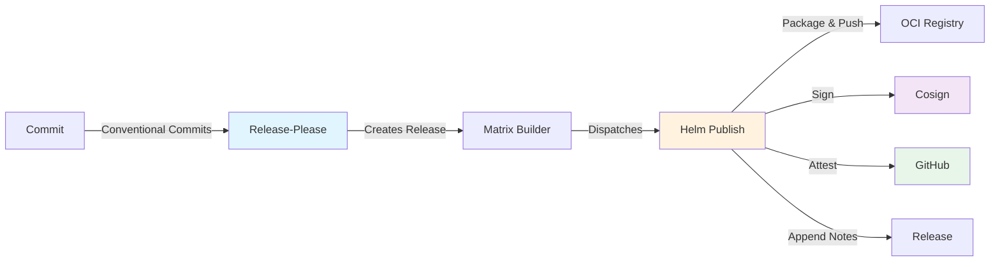
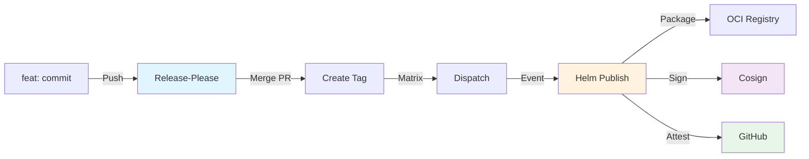

# CI/CD Architecture

!!! abstract "Quick Overview"
    Automated CI/CD pipeline for Helm chart releases using GitHub Actions. Features: automated versioning with Release-Please, OCI registry publishing with keyless signing (Sigstore/Cosign), dependency management via Renovate, and comprehensive security scanning.

    **Reading Time:** ~5 minutes

## System Overview

The CI/CD pipeline automates the complete lifecycle from code commit to signed Helm chart publication:



## Core Workflows

### 1. Release Automation (`release-please.yml`)

**Purpose:** Automated semantic versioning and releases for Helm charts in monorepo.

**Trigger:** Push to `main` branch

**How It Works:**

1. **Release Job** - Analyzes conventional commits, creates/updates release PRs with CHANGELOGs
2. **Matrix Builder** - When release PR merges, builds JSON matrix of released charts
3. **Dispatcher** - Sends `repository_dispatch` event for each chart to trigger publishing

**Key Features:**

- Independent versioning per chart (monorepo support)
- Automatic version bumping from conventional commits (`feat:`, `fix:`, `chore:`)
- Auto-generated CHANGELOGs
- Parallel publishing for multiple charts

**Configuration:**

- `.release-please-manifest.json` - Current chart versions
- `release-please-config.json` - Release-Please settings (tag format: `<chart>-<version>`)
- `src/deployments/release_matrix.py` - Matrix builder CLI

### 2. Chart Publishing (`helm-publish.yml`)

**Purpose:** Package, publish, sign, and attest Helm charts to OCI registry.

**Trigger:** `repository_dispatch` event (type: `helm-release-build`) from release workflow

**Workflow Steps:**

1. **Package** - Run `helm dependency update` and `helm package`
2. **Push** - Push chart to OCI registry, capture digest
3. **Sign** - Keyless signing with Cosign using GitHub OIDC (no private keys!)
4. **Verify** - Verify signature against Rekor transparency log
5. **Attest** - Generate GitHub build provenance attestation
6. **Document** - Create release notes with installation/verification instructions
7. **Publish** - Append release notes to GitHub release

**Security: Keyless Signing**

!!! success "No Private Keys Required"
    Uses Sigstore/Cosign keyless signing:

    - GitHub OIDC token authenticates the workflow
    - Short-lived certificate from Fulcio CA
    - Signature recorded in public Rekor transparency log
    - Verifiable identity: repository + workflow + commit SHA

**Required Secrets** (in `production` environment):

- `HELM_REGISTRY` - OCI registry URL
- `HELM_USERNAME` - Registry username
- `HELM_PASSWORD` - Registry password/token

**Verification:**

```bash
# Verify signature
export COSIGN_EXPERIMENTAL=1
cosign verify \
  --certificate-identity-regexp="https://github.com/<org>/<repo>" \
  --certificate-oidc-issuer="https://token.actions.githubusercontent.com" \
  <registry>/<chart>:<version>

# Verify build provenance
gh attestation verify oci://<registry>/<chart>:<version> --owner <org>
```

### 3. Quality Gates (`pre-commit.yml`)

**Purpose:** Enforce code quality, formatting, and security standards.

**Trigger:** Pull requests and pushes to `main`

**Checks:**

- YAML/JSON syntax and formatting
- Helm chart linting (`helm lint`) and documentation (`helm-docs`)
- Trailing whitespace, file permissions
- Secret scanning (detect hardcoded credentials)
- Python code quality
- Conventional commit format

**Developer Workflow:**

```bash
# Run locally before pushing
uv run pre-commit run -a

# Install git hook to run automatically
uv run pre-commit install
```

The workflow posts helpful PR comments on success/failure with instructions to reproduce locally.

### 4. Documentation (`docs.yml`)

**Purpose:** Deploy MkDocs documentation to GitHub Pages.

**Trigger:** Push to `main` modifying `docs/**`, `mkdocs.yml`, or `pyproject.toml`

**Stack:**

- MkDocs with Material theme
- Git revision dates, search, dark/light mode
- Mermaid diagrams, syntax highlighting

**Deployment:** Runs `uv run mkdocs gh-deploy --force` to publish to GitHub Pages.

### 5. Dependency Management (`renovate.yml`)

**Purpose:** Automated dependency updates.

**Trigger:** Daily schedule + push to `main`

**Updates:**

- GitHub Actions (pinned to commit SHAs)
- Helm chart dependencies
- Python packages (`pyproject.toml`, `uv.lock`)
- Container image versions in Chart.yaml `appVersion` (via custom regex manager)
- Pre-commit hooks

**Key Feature: Automatic `appVersion` Updates**

Renovate monitors Chart.yaml files for the special comment:

```yaml
# renovate: image=images.opencadc.org/platform/skaha
appVersion: "1.1.0"
```

When the container image version changes, Renovate automatically creates a PR to update `appVersion`.

**Configuration:** `renovate.json` + `.github/renovate-config.json`

### 6. Security Scanning (`scorecard.yml`)

**Purpose:** Analyze repository security posture with OpenSSF Scorecard.

**Trigger:** Weekly schedule + push to `main`

**Checks:**

- Branch protection, code review requirements
- Dependency pinning and automated updates
- Token permissions (least privilege)
- Vulnerability scanning
- Security policy (SECURITY.md)
- Dangerous workflow patterns

**Output:** SARIF results published to GitHub Security tab with actionable recommendations.

## Complete Release Flow



**Steps:**

1. Developer pushes conventional commit (`feat:`, `fix:`, etc.) to `main`
2. Release-Please creates/updates release PR with CHANGELOG
3. When PR merges, Release-Please creates git tag and GitHub release
4. Matrix builder creates JSON array of released charts
5. Dispatcher sends `repository_dispatch` event for each chart
6. Helm Publish workflow packages, pushes, signs, attests, and documents chart

## Security & Supply Chain

### Keyless Signing

**Traditional vs. Keyless:**

| Traditional | Keyless (Sigstore) |
|-------------|-------------------|
| Manage private keys | No keys - uses GitHub OIDC |
| Key rotation complexity | Short-lived certificates |
| Key compromise risk | Identity tied to workflow |
| Manual key distribution | Public transparency log (Rekor) |

**How Keyless Signing Works:**

1. GitHub Actions generates OIDC token with workflow identity
2. Cosign requests certificate from Fulcio CA using OIDC token
3. Fulcio issues short-lived certificate tied to GitHub identity
4. Cosign signs chart and records signature in Rekor transparency log
5. Users verify signature against Rekor, validating repository + workflow identity

**Verification:**

```bash
# Verify signature came from official workflow
cosign verify \
  --certificate-identity-regexp="https://github.com/<org>/<repo>" \
  --certificate-oidc-issuer="https://token.actions.githubusercontent.com" \
  <oci-reference>
```

### Supply Chain Layers

- **Code Quality:** Pre-commit hooks, Scorecard analysis
- **Dependencies:** Renovate updates, pinned GitHub Actions (commit SHAs)
- **Build:** Reproducible Helm packages with SHA256 digests
- **Signing:** Keyless signing with Cosign, recorded in Rekor
- **Attestation:** GitHub build provenance (SLSA framework)
- **Verification:** Signature + attestation verification before deployment

## Configuration

### Required Secrets

| Secret | Workflow | Purpose |
|--------|----------|---------|
| `HELM_REGISTRY` | helm-publish | OCI registry URL |
| `HELM_USERNAME` | helm-publish | Registry username |
| `HELM_PASSWORD` | helm-publish | Registry password/token |
| `RENOVATE_TOKEN` | renovate | GitHub token for Renovate |

**Note:** `GITHUB_TOKEN` is automatically provided by GitHub Actions.

### Deployment Environment

The `production` environment is used by `helm-publish.yml` to store registry credentials. Can be configured with protection rules for manual approval.

### Workflow Permissions (Least Privilege)

- **release-please:** `contents: write`, `pull-requests: write`
- **helm-publish:** `contents: write`, `packages: write`, `id-token: write`, `attestations: write`
- **pre-commit:** `contents: read`, `pull-requests: write`
- **docs:** `contents: write`
- **renovate:** `contents: write`, `pull-requests: write`
- **scorecard:** `security-events: write`, `id-token: write`

## Troubleshooting

### Common Issues

**Release-Please Not Creating Releases**

- Check commit messages follow conventional format (`feat:`, `fix:`, etc.)
- Validate JSON configuration: `jq . release-please-config.json`
- View logs: `gh run list --workflow=release-please.yml`

**Helm Publish Failures**

- Verify secrets in production environment: `gh secret list --env production`
- Check workflow logs: `gh run view <run-id> --log`
- Test locally: `helm package <chart-path>` and `helm push`

**Pre-commit Failures**

- Run locally: `uv run pre-commit run -a`
- Fix specific hook: `uv run pre-commit run <hook-id> -a`
- Clear cache: `uv run pre-commit clean`

### Manual Triggers

**Helm Publish (via repository_dispatch):**

```bash
gh api repos/<org>/<repo>/dispatches \
  -f event_type=helm-release-build \
  -f client_payload[chart_name]=<chart> \
  -f client_payload[chart_path]=helm/applications/<chart> \
  -f client_payload[chart_version]=<version> \
  -f client_payload[tag_name]=<chart>-<version> \
  -f client_payload[sha]=$(git rev-parse HEAD)
```

**Documentation:**

```bash
gh workflow run docs.yml -f reason="Manual update"
```

**Renovate:**

```bash
gh workflow run renovate.yml -f reason="Manual dependency check"
```

### Monitoring

```bash
# Workflow runs
gh run list --limit 20
gh run view <run-id> --log

# Releases
gh release list
gh release view <tag-name>

# Security
gh api repos/<org>/<repo>/code-scanning/alerts
```

## Best Practices

### Developers

- **Conventional Commits:** Use `feat:`, `fix:`, `docs:`, `chore:` for automatic versioning
- **Pre-commit Hooks:** Run `uv run pre-commit install` to catch issues before push
- **Test Charts:** Validate with `helm lint` and `helm template` before committing
- **Review Release PRs:** Check generated CHANGELOGs and version bumps

### Operators

- **Rotate Secrets:** Update registry credentials periodically
- **Monitor Renovate:** Review and merge dependency PRs promptly
- **Check Scorecard:** Address security recommendations in GitHub Security tab
- **Backup Config:** Keep copies of workflow files and secret values

### Security

- **Verify Before Deploy:** Always verify signatures and attestations

    ```bash
    export COSIGN_EXPERIMENTAL=1
    cosign verify --certificate-identity-regexp="..." <oci-ref>
    gh attestation verify <oci-ref> --owner <org>
    ```

- **Audit Access:** Review who has access to secrets and environments
- **Monitor Rekor:** Check transparency logs for unexpected signatures

## References

- [GitHub Actions](https://docs.github.com/en/actions)
- [Release-Please](https://github.com/googleapis/release-please)
- [Sigstore/Cosign](https://docs.sigstore.dev/)
- [Helm](https://helm.sh/docs/)
- [OpenSSF Scorecard](https://github.com/ossf/scorecard)
- [Renovate](https://docs.renovatebot.com/)
- [Conventional Commits](https://www.conventionalcommits.org/)
- [SLSA Framework](https://slsa.dev/)
